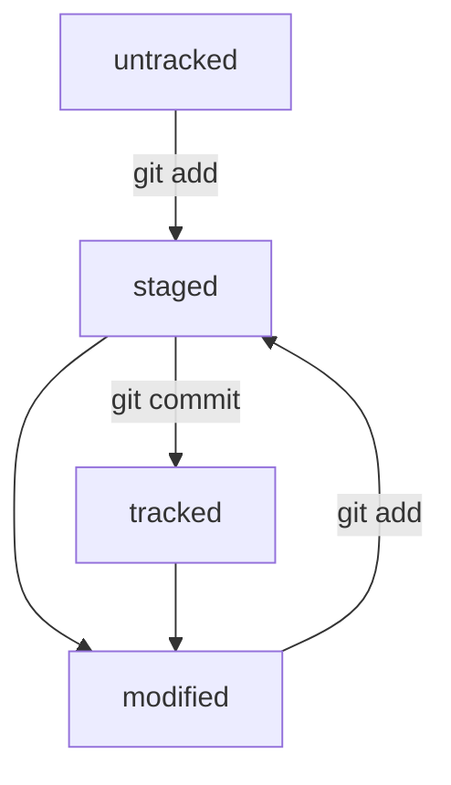

# Инструкция

Как сказал Конфуций:

>«Благородный человек предъявляет требования к себе, низкий человек предъявляет требования к другим»

============

Хеш — идентификатор коммита
Вызов - git log
`HEAD` — всему голова (указывает на коммит, который сделан последним)

============

`untracked` - новые файлы в Git-репозитории
`staged` - список файлов, которые войдут в коммит
`tracked` -  файлы, которые уже были зафиксированы с помощью `git commit`
`modified` - Git сравнил содержимое файла с последней сохранённой версией и нашёл отличия

